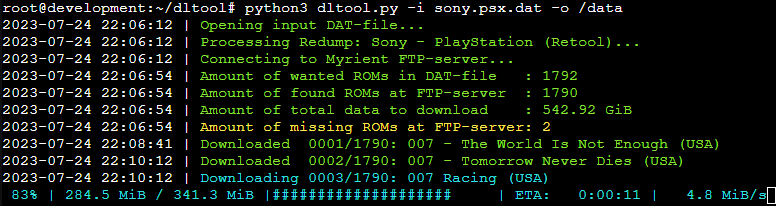

# Tool to download contents of a DAT collection from Myrient



## Info
First of all, <b>huge thanks</b> to the people behind Myrient for the fantastic service they're providing!

With this tool it is not necessary to download terabytes worth of complete ROMsets, just to delete most of it afterwards. Instead, with this tool you can download only the ROMs in your filtered DAT-file from Myrient.

Resuming downloads after an interruption should work, however this functionality isn't fully tested.

I've also tested this only on Linux, but I suppose it should work on Windows also.

## Requirements
The script uses external progressbar2 -library, which can be installed using:
```
pip3 install -r requirements.txt
```
or
```
python3 -m pip install -r requirements.txt
```

## Usage
```
python3 dltool.py -i romset.dat -o /data/roms
```

### Arguments
#### Required
| Argument      | Definition                                                     |
| ------------- | -------------------------------------------------------------- |
| -i romset.dat | Input DAT-file containing wanted ROMs                          |
| -o /path      | Output path for ROM files to be downloaded                     |

#### Optional
| Argument      | Definition                                                     |
| ------------- | -------------------------------------------------------------- |
| -c            | Choose catalog manually, even if automatically found           |
| -s            | Choose system collection manually, even if automatically found |
| -l            | List only ROMs that are not found in FTP-server (if any)       |
| -h            | Display help message                                           |
